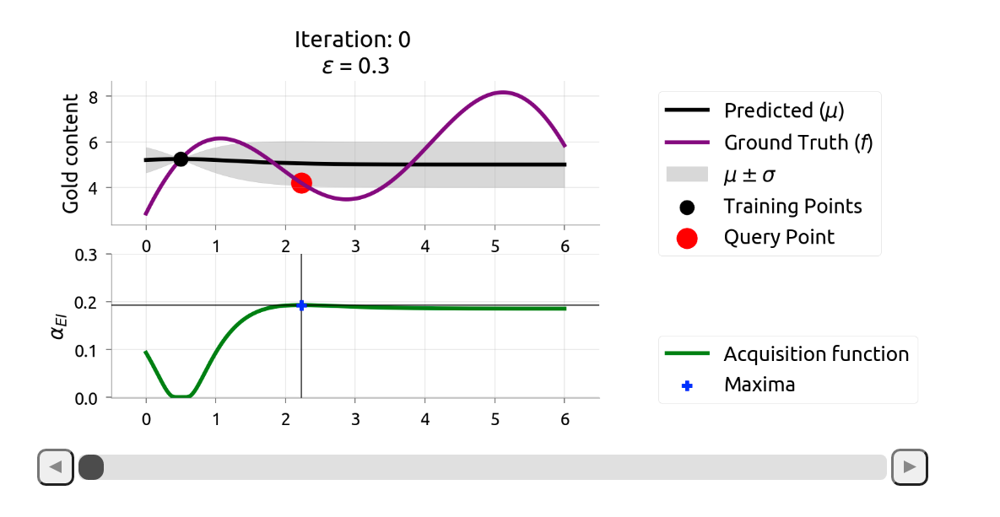
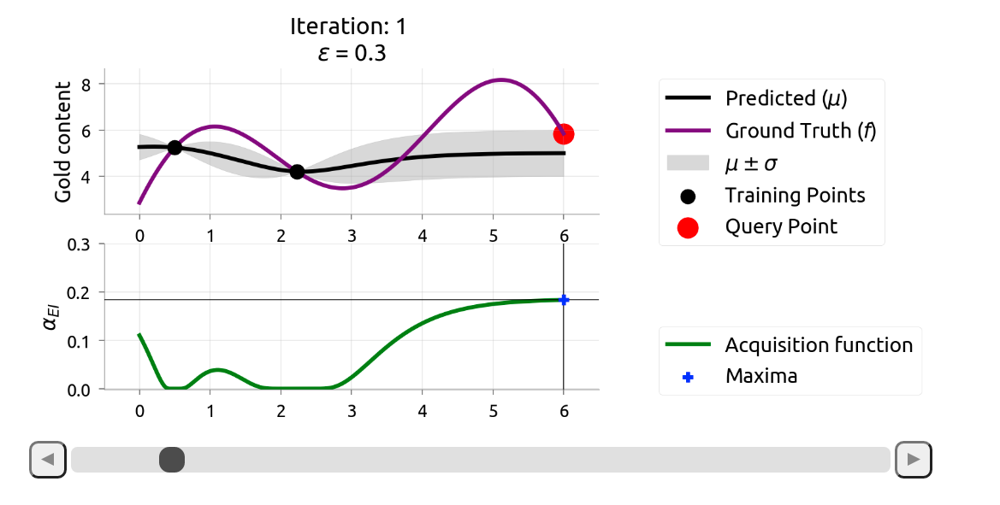
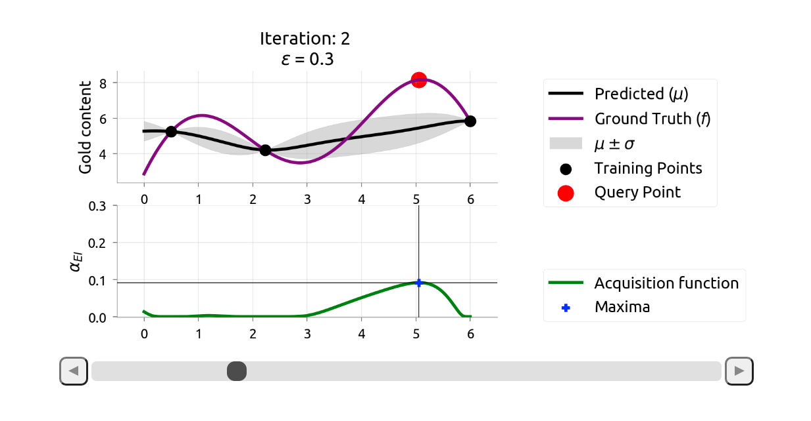
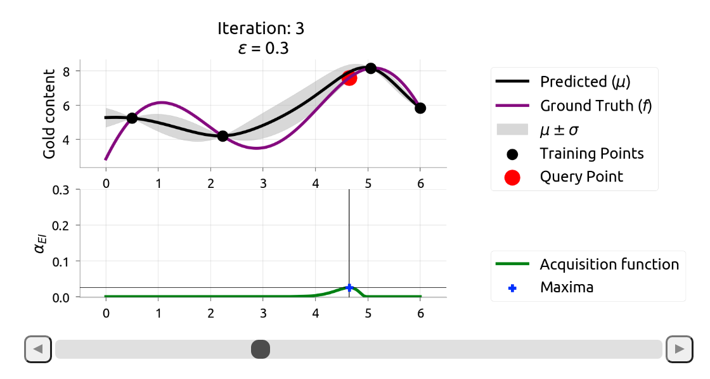
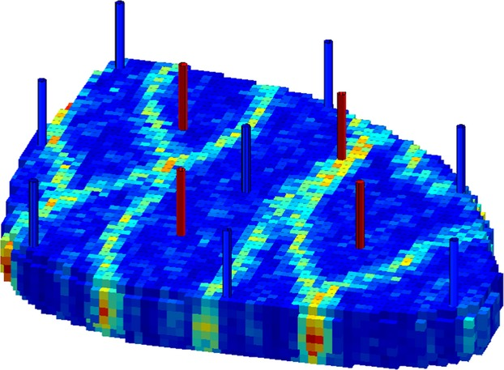
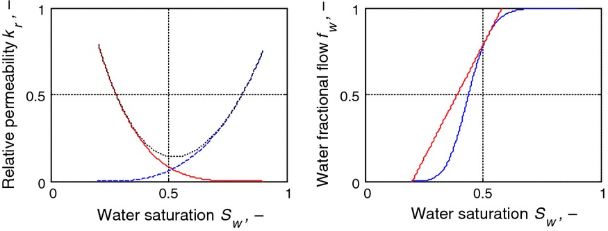
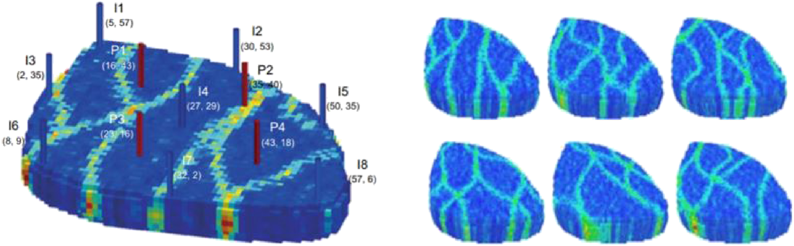

```{r setup, include=FALSE}
options(htmltools.dir.version = FALSE)
library(knitr)
library(gt)
library(kableExtra)
library(xaringanthemer)
library(ParBayesianOptimization)
library(latex2exp)
library(ggplot2)
ggplot2::theme_update(text=element_text(size=21))

style_duo_accent(
  primary_color = "#1b9aaa",
  secondary_color = "#ffc43d"
  #text_font_google = google_font("Coming Soon"),  #<< this is crazy but okay
  #header_font_google = google_font("Trade Winds") #<< very on brand for Tampa
)

knitr::opts_chunk$set(warning = FALSE, message = FALSE, cache = TRUE)
# options(knitr.table.format = "html")
library(tidyverse)
library(babynames)
library(fontawesome) # from github: https://github.com/rstudio/fontawesome
library(DiagrammeR)
```

name: xaringan-title
class: center, top
background-image: url(test2.jpg)
background-size: cover

# BayesOpt : A New Sample Efficient Workflow for Reservoir Optimization under Uncertainty

<!-- # -->

<!-- ### .fancy[Making slides in R Markdown] -->

<br>
<br>
### .large[Peyman Kor | Energy Resource Department, University of Stavanger]
### .large[Presentation for DigiRes Meeting, 30 June 2021]
<!-- this ends up being the title slide since seal = FALSE-->
---

---
name: sfah
class: top, top

## Introduction: Peyman Kor
.left-column[

```{r, echo=FALSE, out.width="600px", fig.align="center", out.height= "400px"}

```

]
--
.right-column[

 * `r emo::ji("Norway")` PhD Student in Computational Engineering, University of Stavanger, Dec 2020 - Ongoing

  - Proxy-based Workflow for Reservoir Optimization under Uncertainty (DigiRes project)
  - Sequential Decision Making/Reinforcement Learning/ Stochastic Optimization
  - Supervisors: Reidar B. Bratvold and Aojie Hong

{{content}}
]
--

 * `r emo::ji("Denmark")` M.Sc in Applied Mathematics and Computation, Technical University of Denmark (2019 - 2020)
 
 <!-- - Bayesian Neural Network for Probabilistic Forecasting -->

{{content}}
--

 * `r emo::ji("Norway")` M.Sc in Reservoir Engineering, University of Stavanger (2017-2019)
 <!-- - Development of XGBOOST model as Proxy Model for Numerical Rservoir Simulator -->

{{content}}
--

 * `r emo::ji("Iran")` B.Sc in Petroleum Engineering , Petroleum University of Technology (2011-2016), IRAN
 <!-- - Asphaletene Deposition Modeling along Wellbore -->

{{content}}

---
class: center, top
## Today Presentation:

<br/>

--
### Part I) Problem Statement

--

### Part II) Workflow of Bayesian Optimization and Illustation

--

### Part III) Demonstarte the BayesOpt Application to Reservoir Optimization 

--

---

class: center, middle
## Part I) Problem Statement

---
## Part I) Problem Statemnet:

--
- In reservoir optimization, we can have different objectives: Recovery Factor, Net Present Value (NPV), ...

$$u_M = \underset{u \in \text{constraints}}{\mathrm{argmax}}\, \text{Objective Func(u)}$$
 $u$ is a decision variable to make: could be injection rate, well locations, order of drilling wells.
--
 $$\color{blue} {\text{Deterministic Optimization}}:\quad \text{Objective Func(u)}=J(u,G)=\sum_{k=1}^{n_T} \frac{q_o^k(u, G)P_o-q^k_w(u,G)P_{wp}-I^k(u,G)P_{wi}}{(1+b)^{t_k/D}}$$
--

$$\color{blue} {\text{Robust Optimization}} \qquad \qquad \text{Objective Func(u)}= \overline{J}(u) = \frac{\sum_{i=1}^{n_e} J_r(u,G_i)}{n_e}$$
--
---
## Part I) Problem Statement

$$\color{blue} {\text{Robust Optimization}} \qquad \qquad \text{Objective Func(u)}= \overline{J}(u) = \frac{\sum_{i=1}^{n_e} J_r(u,G_i)}{n_e}$$

--

#### Example case: 

- Lets' say you are optimizng the well control problem with dimension, $d=10$

--

- Number of 3D geological realizations is $n_e=100$ and running each possible $u^*$in commercial reservoir simulator, at each realization talks ~ 1 hour. Then time it takes to calculate $\overline{J}(u^*)$ is ~ 100 hours.

--

- With 6 month CPU running time budget, the total available budget is to run is ~ 50.

--

- Availablity of only 50 $\overline{J}(u^*)$ evaluation is a small budget, considering the 10 dimentional optimization problem.

--

#### **<span style="color:red"> Problem:</span>**<span style="color:red">  $\overline{J}(u)$ is expensive function, meaning the # times we can evaluate it severely limited. </span>

--

#### **<span style="color:green"> Solution:</span>**<span style="color:green">  Bayesian Optimization (BayesOpt) propose a new workflow to conduct optimization at the small $\overline{J}(u)$ budget, without affecting the optimum solution.

---

## Expensive objective functions, who doesn’t have one?

--

*Parameter tuning in ML algorithms.*
--

```{r, echo=FALSE, fig.align='center', out.width="500px", out.height="300px"}
knitr::include_graphics("img/deeplearning.png")
```

--

- Number of layers/units per layer
- learning rates, etc.

--

---
## Expensive objective functions, who doesn’t have one?

--

*Active Path Finding*

--

```{r, echo=FALSE, fig.align='center', out.width="500px", out.height="300px"}

```
--
<br>
- Optimise the location of a sequence of waypoints in a map to navigate from a location to a destination.

---
## Expensive objective functions, who doesn’t have one?
--

- Robotics, control, reinforcement learning.
- Compilers, hardware, software.
- Industrial design.

--

```{r, echo=FALSE, fig.align='center', out.width="900px", out.height="400px"}
knitr::include_graphics("img/egg.gif")
```

<!-- {} -->

---

class: center, middle
## Part II) Workflow of Bayesian Optimization and Illustation

---
## Part II) Workflow of Bayesian Optimization and Illustation
### Bayesian Optimization - Overall Idea

Workflow to perform global optimization of multimodal black-box functions:
--

####Step 1. Choose some initial design points and build a  <span style="color:red">probabilistic model</span> over the space of objective $\overline{J}(u)$, 
<!-- this probabilistic model <span style="color:red">serves as prior</span>.  -->
{{content}}

--

####Step 2. Combine step1. and the observationsto get a <span style="color:red">posterior of probabilistic model</span> 
{{content}}

--

####Step 3. Use the posterior to <span style="color:red">decide</span> where to take the next evaluation $\bf{u^*}$ according to some <span style="color:red">policy </span>.
{{content}}
--

####Step 4. Evaluet the $\overline{J}(u)$ at $\bf{u^*}$ and <span style="color:red">augment it to the initial data</span>, in step 1.
{{content}}
--

Iterate between 2 and 4 until the evaluation budget is over.
---

## Step 1,2: Gaussian Process (GP) as Probalistic Model

Ref: (Kevin P. Murphy, Probabilistic Machine Learning: An introduction, 2021- Ch17)
{{content}}
--
- Key Assumption in (GP) is that: the function values at a set of $M > 0$ inputs, $\bf{\overline{J}(u)} = [\overline{J}(u_1), ...,\overline{J}(u_M)]$, is jointly Gaussian, with mean $(\mu = m(u_1),...m(u_M))$ and 
{{content}}
--
- Covariance $\sum_{i,j}= \Large \kappa(u_i,u_j)$ , and $\Large \kappa$ is a positive definite (Mercer) kernel.
{{content}}
--
$$\begin{bmatrix}  {\bf {\overline{J}}_U}  \\  {{\bf \overline{J}}_*} \end{bmatrix} \sim\mathcal{N} \begin{pmatrix} (\begin{bmatrix}  {{\bf \mu}_U}  \\  {{\bf \mu}_*} \end{bmatrix}),\begin{bmatrix} {{\bf K}_{U,U}}  & {{\bf
K}_{U,*}}  \\  {{\bf \mathbf{K}^\intercal}_{U,*}} & {{\bf K}_{*,*} } \end{bmatrix}\end{pmatrix}$$
--
$$p(\overline{J}_*|U_*,\mathcal{D}) = \mathcal{N}(\overline{J}_*|{{\bf \mu}_*} , \scriptsize{\sum}_{*}\normalsize)=$$
$${{\bf \mu}_*}=m(\bf U_*) +{\bf \mathbf{K}^\intercal}_{U,*}{\bf \mathbf{K}^{-1}}_{U,U}(\overline{J}_U-m(U))$$
$$\scriptsize{\sum}_{*}= \normalsize{\mathbf{K}_{*,*}-\mathbf{K}^\intercal_{U,*}\mathbf{K}_{U,U}^{-1}\mathbf{K}_{U,*}}$$
--
---
## Example of Step.1 and Step.2

```{r, echo=FALSE}
library(plgp)
library(mvtnorm)
plot_multivariate_gauss <- function(vector_of_x,eps) {
  
  X <- matrix(vector_of_x,ncol = 1)
  y <- sin(X)
  D <- distance(X) 
  Sigma <- exp(-D) + diag(eps, ncol(D))

  XX <- matrix(seq(-0.5, 2*pi + 0.5, length=100), ncol=1)
  DXX <- distance(XX)
  SXX <- exp(-DXX) + diag(eps, ncol(DXX))
  
  DX <- distance(XX, X)
  SX <- exp(-DX) 
  
  Si <- solve(Sigma)
  mup <- SX %*% Si %*% y
  Sigmap <- SXX - SX %*% Si %*% t(SX)
  
  YY <- rmvnorm(100, mup, Sigmap)
  
  q1 <- mup + qnorm(0.05, 0, sqrt(diag(Sigmap)))
  q2 <- mup + qnorm(0.95, 0, sqrt(diag(Sigmap)))
  
  matplot(XX, t(YY), type="l", col="gray", lty=1, xlab="x", ylab="y", 
          main="Gaussian Process Regression")
  points(X, y, pch=20, cex=2)
  lines(XX, sin(XX), col="blue")
  lines(XX, mup, lwd=2, col="black")
  lines(XX, q1, lwd=2, lty=2, col=2)
  lines(XX, q2, lwd=2, lty=2, col=2)
  legend("top", legend=c("A Sample", "True function", "Mean curve","90% CI", 
                              "90% CI", "Design points"),
         col=c("gray", "blue","black" ,"red","red","black"),lty=c(1,1,1,2,2,NA),
         pch = c(NA, NA,NA,NA,NA,20),
         cex=1.2, box.col = "white",bg = "white", ncol = 3)}
```

.pull-left[
- Assume $U=[0,3,5,6]$ and $\overline{J}(u)=sin(u)$, giving $\mathcal{D}=(U,\overline{J}(U))$. What is $p(\overline{J}_*|U_*,\mathcal{D})$?
{{content}}
]
--
```{r, echo=FALSE, fig.retina=2, fig.asp=1}
plot_multivariate_gauss(c(0,3,5,6), 10^-6)
```
--

.pull-right[
- Now we sample the point $u=1$, and add to $\mathcal{D}$
{{content}}
]
--
```{r, echo=FALSE, fig.retina=2, fig.asp=1.1}
plot_multivariate_gauss(c(0,1,3,5,6), 10^-6)
```
--
---
## Step.3 Deciding on next $\bf{u}^{next}$ based on Posterior

{{content}}

--
- Posterior of the probalistic model  quantify the uncertainty over the space of the $\overline{J}(u)$. The question is what is the next $\bf{u}^{next}$ to be sampled from the *expensive function*?

{{content}}
--
- Collect a new data point satisfying some optimality criterion: optimization as decision making.
{{content}}
--
<!-- - There are a few of policies in the literature of Bayesopt, here the *Expected Improvement (EI)* policy will be used. -->

<!-- --- -->

<!-- ## Step.3 Deciding on next $\bf{x}^*$ based on Posterior -->
<!-- ### Expected Improvement as Policy for Decision Making -->

<!-- - In Expected Improvement (EI) policy: <span style="color:red"> choose the next query point as the one which has the highest expected improvement over the space of the *expensive function*, f.</span>   -->
<!-- {{content}} -->
<!-- -- -->
<!-- $$utility(x;\theta,\mathcal{D})=\alpha_{EI}=\int_{y}^{}max(0,y-f)p(y|x;\theta,\mathcal{D}) \,dy$$ -->
<!-- {{content}} -->
<!-- -- -->
<!-- - However, we do not have access to the *expensive function*, $f$, therefore we replace the $f$ with the best available solution found so far, $y^+$ -->
<!-- - $$utility(x;\theta,\mathcal{D})=\alpha_{EI}=\int_{y}^{}max(0,y-y⁺)p(y|x;\theta,\mathcal{D}) \,dy$$ -->
<!-- {{content}} -->
<!-- -- -->
<!-- - $y^+$ : The best solution found in the training dataset $\mathcal{D}$ -->
<!-- -- -->
<!-- --- -->
<!-- ## Step.3 Deciding on next $\bf{x}^*$ based on Posterior -->
<!-- ### Expected Improvement as Policy for Decision Making (cont) -->
<!-- - The good news: The analytical form of the utility function is available for the gaussian process -->
<!-- {{content}} -->
<!-- -- -->

<!-- - $$\gamma(\mathbf{x})=\frac{\mu(\mathbf{x;\theta,\mathcal{D}})-y^+}{\sigma(\mathbf{x;\theta,\mathcal{D}})}$$ -->
<!-- - $$utility(\mathbf{x};\theta,\mathcal{D})=\alpha_{EI}(x;\theta,\mathcal{D})=(\mu(x;\theta,\mathcal{D})-y^+)\Phi(\gamma(x)) + \sigma(x;\theta,\mathcal{D})\phi(\gamma(x))$$ -->
<!-- - Where $\Phi(.)$ and $\phi(.)$ are CDF and PDF of standard Gaussian distribution.  -->
<!-- {{content}} -->
<!-- -- -->
<!-- - It is too greedy in the context of the sequential decision making. Therefore, an explorative term is added as  <span style="color:red">"explorative" parameter $\epsilon$ </span>. -->
<!-- {{content}} -->
<!-- -- -->

$$\gamma(\mathbf{u})=\frac{\mu(\mathbf{u;\theta,\mathcal{D}})-\overline{J}^+-\epsilon}{\sigma(\mathbf{u;\theta,\mathcal{D}})}$$
$$\alpha_{EI}(u;\theta,\mathcal{D})=(\mu(u;\theta,\mathcal{D})-\overline{J}^+-\epsilon)\Phi(\gamma(u)) + \sigma(u;\theta,\mathcal{D})\phi(\gamma(u))$$
- $\mu(\mathbf{u;\theta,\mathcal{D}})$: mean value of the posterior model at point $u$, 
- $\sigma (\mathbf{u;\theta,\mathcal{D}})$: sd value of the posterior model at point $u$. 
- $\overline{J}^+$: the best $\overline{J}(u)$ in the design points, $\mathcal{D}$.

{{content}}

--

$$\color{red}{u^{next} = \underset{u}{\mathrm{argmax}} \;\; \alpha_{EI}(u;\theta,\mathcal{D})}$$
--
---
## Example: Illustration of Bayesian Optimization
{{content}}
--

- We want to find the maximum of the *Ground Truth* function, in purple color. 
<br/>
<br/>
Iteration: 0

```{r, echo=FALSE, fig.align='center', out.width="700px", out.height="400px", fig.retina=4}

```
---
## Example: Illustration of Bayesian Optimization
{{content}}
--

- We want to find the maximum of the *Ground Truth* function, in purple color. 
<br/>
<br/>
- Iteration: 1

```{r, echo=FALSE, fig.align='center', out.width="700px", out.height="400px", fig.retina=4}

```
---

## Example: Illustration of Bayesian Optimization
{{content}}
--

- We want to find the maximum of the *Ground Truth* function, in purple color. 
<br/>
<br/>
- Iteration: 2

```{r, echo=FALSE, fig.align='center', out.width="700px", out.height="400px", fig.retina=4}

```
---

## Example: Illustration of Bayesian Optimization
{{content}}
--

- We want to find the maximum of the *Ground Truth* function, in purple color. 
<br/>
<br/>
- Iteration: 3

```{r, echo=FALSE, fig.align='center', out.width="700px", out.height="400px", fig.retina=4}

```
---
## Bayesian Optimization:
### As a "mapping" between two problems

- BO is an strategy to transform the problem

$$u_M = \underset{u \; \in \; constraints}{\mathrm{argmax}}\, \overline{J}(u)$$
{{content}}
--
$$\color{red} {unsolvabale!}$$
{{content}}
--
- $$u^{next}=\underset{u \; \in \; constraints}{\mathrm{argmax}}\, \alpha_{EI}(u;\mathcal{D}_n, \theta^*)$$
{{content}}
--

$$\color{green} {solvabale!}$$
{{content}}
--
- $\alpha_{EI}(u)$ is inexpensive to evaluate.
- The analytical expression for gradient of $\alpha_{EI}(u)$ is available.
- Still need to find $u^{next}$, the multi-start BFGS is used for finding $u^{next}$.


---
## BayesOpt Applied to Reservoir Case:

--
Egg Model (8 Injection wells, 4 Production wells)

.pull-left[
- Egg Model <font size="3"> (Jansen, J. D., et al (2014). The egg model–a geological ensemble for reservoir simulation. Geoscience Data Journal, 1(2), 192-195)</font>

```{r, echo=FALSE, fig.align='center', out.width="600px", out.height="300px", fig.retina=4, fig.cap="Well locations in Egg model, channalized reservoir"}

```
]


--

.pull-right[

- Rel Perm Curves

```{r, echo=FALSE, fig.align='center', out.width="400px", out.height="300px", fig.retina=4, fig.cap="Relative permeabilities and, associated fractional flow curve"}

```

]

---

## BayesOpt Applied to Reservoir Case:
### Optimization Objective

--
- $$J(u)= NPV(u)=\sum_{k=1}^{n_T} \frac{q_o^k(u)P_o-q^k_w(u)P_{wp}-I^k(u)P_{wi}}{(1+b)^{t_k/D}}$$
- $$ \overline{J}(u) = \frac{\sum_{r=1}^{n_e} J_r(u)}{n_e} $$
--

.pull-left[
+ $u$ is Injection rate for the each injection well, 
+ $u=[u_{inj1},u_{inj2},u_{inj3},u_{inj4},u_{inj5},u_{inj6},u_{inj7},u_{inj8}]^{\intercal}$
<br/>
<br/>
```{r, echo=FALSE}
price_data <- tibble(item_1=c("$P_o$","$P_{wp}$","$P_{wi}$"),
                     price=c("315","47.5","12.5"),
                     item_2=c("b","D","$n_e$"),
                     price2=c("8%","365","10"))

colnames(price_data) <- c("Item","Price in ($/m3)", "Items", "Value")
price_data %>%  kableExtra::kable(format = "html", escape = FALSE) %>% 
    kable_styling()
``` 
]
--

.pull-right[

```{r, echo=FALSE, fig.align='right', out.width="500px", out.height="200px", fig.retina=4}

```

]
--
---

## BayesOpt Applied to Reservoir Case:

--
- Constrain on the Injection Rates, can be adjusted from $5m^3/day$ to $100m^3/day$. 
- Initial reservoir pressure at the first layer is 400 bars, and producers are under minimal BHP of 395 bars.
- Latin hyper cube sampling (LHS) was conducted for initial design to calculate the $\mathcal{D}$: 
--

```{r, echo=FALSE, fig.retina=3, fig.align='center', fig.height=6, fig.width=12}
bo_123 <- readRDS("processed_data/bo_123_401000.Rds")
bo_123$scoreSummary[1:40,] %>% 
  arrange(Score) %>% 
  ggplot(aes(Iteration, Score)) +
  geom_point(colour = "blue", size = 3)+
  xlab("Sample Number") + ylab("Expected NPV (in $MM)") +
  scale_x_continuous(limits = c(1, 40),breaks = seq(0,40,2))+
  scale_y_continuous(limits = c(28, 38),breaks = seq(28,38)) +
  geom_hline(aes(yintercept = max(bo_123$scoreSummary[1:40,]$Score))) +
  geom_text(aes(5, max(bo_123$scoreSummary[1:40,]$Score), 
                label = "Maximum Point in LHS", vjust = - 1)) +
  labs(x = TeX("Number of Samples, $# \\bar{J}(u)$"))
```
```{r}
TeX('$\\gamma^\\alpha$')
```

```{r, echo=FALSE, eval=FALSE}
bo_123$scoreSummary[1:40,] %>% arrange(Score)
```

---
## BayesOpt Applied to Reservoir Case:

.pull-left[
- Blue Points represents initial design, Red points shows BayesOpt Sampling.
<br/>
<br/>
```{r,echo=FALSE, dpi=600, fig.asp=0.9}
bo_123 <- readRDS("processed_data/bo_123_401000.Rds")
opt_type <- c(rep("LHS Sampling",40),rep("Bayesian Opt",10))

bo_123$scoreSummary[1:50,] %>% 
  add_column(Sampling_Scheme = opt_type) %>% 
  ggplot(aes(Iteration, Score, colour = Sampling_Scheme)) +
  geom_point(size = 3)+
  labs(x = TeX("Number of Samples, $# \\bar{J}(u)$")) +
  ylab("Expected NPV (in $MM)") +
  scale_x_continuous(limits = c(1, 50),breaks = seq(0,50,5))+
  scale_y_continuous(limits = c(28, 37),breaks = seq(28,37)) +
  scale_color_manual(values = c("red", "blue")) +
  geom_hline(aes(yintercept = max(bo_123$scoreSummary[1:40,]$Score))) +
  geom_text(aes(10, max(bo_123$scoreSummary[1:40,]$Score), 
                label = "Maximum Point in LHS", vjust = - 1), color="blue") +
  geom_hline(aes(yintercept = max(bo_123$scoreSummary[1:50,]$Score))) +
  geom_text(aes(30, max(bo_123$scoreSummary[1:50,]$Score), 
                label = "Maximum Point in BayesOpt", vjust = - 1)) +
  theme(legend.position = "none")
```

]
--
.pull-right[
- Maximum Value after Optimization of the the Utility Function $\alpha(x;\mathcal{D},\theta)$, (multi-start (1000)- L-BFGS-B) 
<br/>
```{r,echo=FALSE,dpi=600, fig.asp=0.9}
bo_123 <- readRDS("processed_data/bo_123_401000.Rds")
bo_123$scoreSummary %>% 
  ggplot(aes(Epoch, gpUtility)) +
  geom_point(size=3) +
  scale_x_continuous(limits = c(1, 10),breaks = seq(1,10,1))
```

]
--
---

## BayesOpt Applied to Reservoir Case:

--
- Repeat the Optimization, three times, in different initial design points
--
-
```{r,dpi=600, echo=FALSE, fig.width=18, fig.height=8}
library(patchwork)
bo_123 <- readRDS("processed_data/bo_123_401000.Rds")
bo_1234 <- readRDS("processed_data/bo_1234_401000.Rds")
bo_12345 <- readRDS("processed_data/bo_12345_401000.Rds")

opt_type <- c(rep("LHS Sampling",40),rep("Bayesian Opt",10))

plot_bo_123 <- bo_123$scoreSummary[1:50,] %>% 
  add_column(Sampling_Scheme = opt_type) %>% 
  ggplot(aes(Iteration, Score, colour = Sampling_Scheme)) +
  geom_point(size = 3)+
  labs(x = TeX("Number of Samples, $# \\bar{J}(u)$")) + ylab("Expected NPV (in $MM)") +
  scale_x_continuous(limits = c(1, 50),breaks = seq(0,50,5))+
  scale_y_continuous(limits = c(28, 38),breaks = seq(28,38)) +
  scale_color_manual(values = c("red", "blue")) +
  geom_hline(aes(yintercept = max(bo_123$scoreSummary[1:40,]$Score))) +
  geom_text(aes(15, max(bo_123$scoreSummary[1:40,]$Score), 
                label = "Maximum Point in LHS", vjust = - 1),color="blue") +
  geom_hline(aes(yintercept = max(bo_123$scoreSummary[1:50,]$Score))) +
  geom_text(aes(30, max(bo_123$scoreSummary[1:50,]$Score), 
                label = "Maximum Point in BayesOpt", vjust = - 1),color="red")+
  theme(legend.position = "none") 


plot_bo_1234 <- bo_1234$scoreSummary[1:50,] %>% 
  add_column(Sampling_Scheme = opt_type) %>% 
  ggplot(aes(Iteration, Score, colour = Sampling_Scheme)) +
  geom_point(size = 3)+
  labs(x = TeX("Number of Samples, $# \\bar{J}(u)$")) + ylab("Expected NPV (in $MM)") +
  scale_x_continuous(limits = c(1, 50),breaks = seq(0,50,5))+
  scale_y_continuous(limits = c(28, 38),breaks = seq(28,38)) +
  scale_color_manual(values = c("red", "blue")) +
  geom_hline(aes(yintercept = max(bo_1234$scoreSummary[1:40,]$Score))) +
  geom_text(aes(15, max(bo_1234$scoreSummary[1:40,]$Score), 
                label = "Maximum Point in LHS", vjust = - 1),color="blue") +
  geom_hline(aes(yintercept = max(bo_1234$scoreSummary[1:50,]$Score))) + 
  geom_text(aes(30, max(bo_1234$scoreSummary[1:50,]$Score), 
                label = "Maximum Point in BayesOpt", vjust = - 1),color="red") +
  theme(legend.position = "none")


plot_bo_12345 <- bo_12345$scoreSummary[1:50,] %>% 
  add_column(Sampling_Scheme = opt_type) %>% 
  ggplot(aes(Iteration, Score, colour = Sampling_Scheme)) +
  geom_point(size = 3)+
  labs(x = TeX("Number of Samples, $# \\bar{J}(u)$")) + ylab("Expected NPV (in $MM)") +
  scale_x_continuous(limits = c(1, 50),breaks = seq(0,50,5))+
  scale_y_continuous(limits = c(28, 38),breaks = seq(28,38)) +
  scale_color_manual(values = c("red", "blue")) +
  geom_hline(aes(yintercept = max(bo_12345$scoreSummary[1:40,]$Score))) +
  geom_text(aes(15, max(bo_12345$scoreSummary[1:40,]$Score), 
                label = "Maximum Point in LHS", vjust = - 1),color="blue") +
  geom_hline(aes(yintercept = max(bo_12345$scoreSummary[1:50,]$Score))) +
  geom_text(aes(30, max(bo_12345$scoreSummary[1:50,]$Score), 
                label = "Maximum Point in BayesOpt", vjust = - 1),color="red") +
  theme(legend.position = "none") 

plot_bo_123 + plot_bo_12345 + plot_bo_1234

```
--
---

## BayesOpt Applied to Reservoir Case:

--
-  Final Solution $u$, in three different initial design:
--

```{r, echo=FALSE, fig.retina=3, fig.align='center', fig.width=14}
library(ParBayesianOptimization)
u_best_123 <- getBestPars(bo_123)
u_best_1234 <- getBestPars(bo_1234)
u_best_12345 <- getBestPars(bo_12345)

list_best_u <- list(u_best_123,u_best_1234,u_best_12345)
df_list_best_u <- data.frame(matrix(unlist(list_best_u), byrow = F, nrow = 8))
df_list_best_u$inj <- c("Inj1","Inj2","Inj3","Inj4","Inj5","Inj6","Inj7","Inj8")
df_list_best_longer <- df_list_best_u %>% 
  pivot_longer(-inj,names_to = "Replication", values_to = "Injection_Rate")


p1 <- ggplot(data=df_list_best_longer, aes(x=inj, y=Injection_Rate, fill=Replication)) +
geom_bar(width = 0.4, stat="identity", position=position_dodge()) +
  coord_cartesian(ylim = c(5, 100)) +
  scale_color_manual(labels = c("Random LHS #1", "Random LHS #2", "Random LHS #3"),
                     values = c("red", "blue", "green"),
                     aesthetics = "fill") 


df_new <- df_list_best_longer %>% 
  group_by(inj) %>%              
mutate(upper = mean(Injection_Rate) + sd(Injection_Rate), 
         lower = mean(Injection_Rate) - sd(Injection_Rate))


p2 <- ggplot(df_new, aes(x = inj, y = Injection_Rate)) +
  stat_summary(fun.y = mean, geom = "bar", position = position_dodge(width = .9),size = 3) + geom_errorbar(aes(ymin = lower, ymax = upper),
                width = .2,                    # Width of the error bars
                position = position_dodge(.9),
                color='#E69F00') +
  coord_cartesian(ylim = c(5, 100))

p1+p2
```
```{r, eval=FALSE, echo=FALSE, fig.retina=3}
df_new <- df_list_best_longer %>% 
  group_by(inj) %>%              
mutate(upper = mean(Injection_Rate) + sd(Injection_Rate), 
         lower = mean(Injection_Rate) - sd(Injection_Rate))


ggplot(df_new, aes(x = inj, y = Injection_Rate)) +
  stat_summary(fun.y = mean, geom = "bar", position = position_dodge(width = .9),size = 3) + geom_errorbar(aes(ymin = lower, ymax = upper),
                width = .2,                    # Width of the error bars
                position = position_dodge(.9),
                color='#E69F00') +
  coord_cartesian(ylim = c(5, 100))
```


--
---
## BayesOpt Applied to Reservoir Case:
### BayesOpt VS. with other Global Optimization Algorithms

--

#### Particle Swarm Optimization (PSO)

- de Brito, D. U., & Durlofsky, L. J. (2021). Field development optimization using a sequence of surrogate treatments. Computational Geosciences, 25(1), 35-65.

- Jesmani, M., Bellout, M. C., Hanea, R., & Foss, B. (2016). Well placement optimization subject to realistic field development constraints. Computational Geosciences, 20(6), 1185-1209.

--
#### Genetic Algorithm Optimization (GA)

- Chai, Z., Nwachukwu, A., Zagayevskiy, Y., Amini, S., & Madasu, S. (2021). An integrated closed-loop solution to assisted history matching and field optimization with machine learning techniques. Journal of Petroleum Science and Engineering, 198, 108204.
- Bukhamsin, A. Y., Farshi, M. M., & Aziz, K. (2010, January). Optimization of multilateral well design and location in a real field using a continuous genetic algorithm. In SPE/DGS Saudi Arabia Section Technical Symposium and Exhibition. Society of Petroleum Engineers.

---
```{r, echo=FALSE, results='hide'}
bo_12345 <- readRDS("processed_data/bo_12345_401000.Rds")
bo_12345_npv_result <- bo_12345$scoreSummary$Score
bo_12345_npv_result[1:40] <- max(bo_12345_npv_result[1:40])
bo_12345_npv_ite <- bo_12345$scoreSummary$Iteration

for (i in seq(41,50)) {
  
  if (bo_12345_npv_result[i] < bo_12345_npv_result[i-1]){
    
    bo_12345_npv_result[i] <- bo_12345_npv_result[i-1] 
    
  }
  
}

bo_1234 <- readRDS("processed_data/bo_1234_401000.Rds")
bo_1234_npv_result <- bo_1234$scoreSummary$Score
bo_1234_npv_result[1:40] <- max(bo_1234_npv_result[1:40])
bo_1234_npv_ite <- bo_1234$scoreSummary$Iteration

for (i in seq(41,50)) {
  
  if (bo_1234_npv_result[i] < bo_1234_npv_result[i-1]){
    
    bo_1234_npv_result[i] <- bo_1234_npv_result[i-1] 
    
  }
  
}

bo_123 <- readRDS("processed_data/bo_123_401000.Rds")
bo_123_npv_result <- bo_123$scoreSummary$Score
bo_123_npv_result[1:40] <- max(bo_123_npv_result[1:40])
bo_123_npv_ite <- bo_123$scoreSummary$Iteration

for (i in seq(41,50)) {
  
  if (bo_123_npv_result[i] < bo_123_npv_result[i-1]){
    
    bo_123_npv_result[i] <- bo_123_npv_result[i-1] 
    
  }
  
}

#######################BO_50 ############################
bo_123_50 <- readRDS("processed_data/bo_1234_50_10000.Rds")
ss_50 <- bo_123_50$scoreSummary
#ss <- bo_123$scoreSummary

#plot(bo_123_50)
#getBestPars(bo_123_50)

########### GA ######################################

ga_12345 <- readRDS("processed_data/GA_12345.Rds")
ga_12345_npv_result <- rep(ga_12345@summary[,"max"],each=25)
ga_12345_npv_ite <- seq(1,250)

ga_1234 <- readRDS("processed_data/GA_1234.Rds")
ga_1234_npv_result <- rep(ga_1234@summary[,"max"],each=25)
ga_1234_npv_ite <- seq(1,250)

ga_123 <- readRDS("processed_data/GA_123.Rds")
ga_123_npv_result <- rep(ga_123@summary[,"max"],each=25)
ga_123_npv_ite <- seq(1,250)

########### PSO #######################################
#
pso_12345 <- readRDS("processed_data/pso_12345.Rds")
pso_12345_npv_result_i <- rep(0,10)
for (i in 1:10) {
  pso_12345_npv_result_i[i] <- max(-pso_12345$stats$f[[i]])
}

pso_12345_npv_result_i
pso_12345_npv_result <- rep(pso_12345_npv_result_i,each=25)
pso_12345_npv_ite <- seq(1,250)

#
pso_1234 <- readRDS("processed_data/pso_1234.Rds")
pso_1234_npv_result_i <- rep(0,10)
for (i in 1:10) {
  pso_1234_npv_result_i[i] <- max(-pso_1234$stats$f[[i]])
}
pso_1234_npv_result <- rep(pso_1234_npv_result_i,each=25)
pso_1234_npv_ite <- seq(1,250)

#
pso_123 <- readRDS("processed_data/pso_123.Rds")
pso_123_npv_result_i <- rep(0,10)
for (i in 1:10) {
  pso_123_npv_result_i[i] <- max(-pso_123$stats$f[[i]])
}
pso_123_npv_result <- rep(pso_123_npv_result_i,each=25)
pso_123_npv_ite <- seq(1,250)

#pso_123$par
#####################################################################

NPV_max_data <- c(bo_12345_npv_result, bo_1234_npv_result, bo_123_npv_result, 
                  ga_12345_npv_result, ga_1234_npv_result, ga_123_npv_result,
                  pso_12345_npv_result, pso_1234_npv_result, pso_123_npv_result)


Reservoir_Simulation_number = c(bo_12345_npv_ite, bo_1234_npv_ite,bo_123_npv_ite, 
                                ga_12345_npv_ite, ga_1234_npv_ite, ga_123_npv_ite,
                                pso_12345_npv_ite, pso_1234_npv_ite,pso_123_npv_ite)


methods_alg <- c(rep("BO",50), rep("BO",50),rep("BO",50),
                 rep("GA",250), rep("GA",250),rep("GA",250),
                 rep("PSO",250), rep("PSO",250),rep("PSO",250))

seed_alg <- c(rep("Repeat1",50), rep("Repeat2",50),rep("Repeat3",50),
                 rep("Repeat1",250), rep("Repeat2",250),rep("Repeat3",250),
                 rep("Repeat1",250), rep("Repeat2",250),rep("Repeat3",250))

comp_data_frame <- tibble(NPV_max= NPV_max_data, 
                          Reservoir_Simulation = Reservoir_Simulation_number,
                          method=methods_alg,
                          see_number=seed_alg) 

#ggplot(comp_data_frame, aes(Reservoir_Simulation, NPV_max, colour=method)) +
#  geom_point() +
#  facet_grid(cols = vars(see_number)) +
#  xlab("Required Number of Reservoir Simulation (forward modeling)") +
#  ylab("-Max NPV Reached")

```

## BayesOpt Applied to Reservoir Case:
BayesOpt VS. with other Global Optimization Algorithms

--
- Fixed Reservoir Simulation Budget (N=50)
```{r,echo=FALSE, fig.retina=3, fig.align='center', fig.width=14, fig.height=6}
comp_data_frame_50sample <- comp_data_frame %>% 
  group_by(method) %>% 
  filter(Reservoir_Simulation<51 & Reservoir_Simulation>0)

ggplot(comp_data_frame_50sample, aes(Reservoir_Simulation, NPV_max, group=method)) +
  geom_point(aes(shape=method, color=method), size=2)+
  scale_shape_manual(values=c(16, 5, 0))+
  scale_color_manual(values=c('red','#E69F00', '#56B4E9'))+
  theme(legend.position="top") +
  facet_grid(cols = vars(see_number)) +
  labs(x = TeX("Number of Required, $ \\bar{J}(u)$ Evaluation")) +
  #xlab("Required #of Reservoir Simulation (forward modeling)") +
  ylab("Max NPV Reached") +
  theme(panel.spacing = unit(3, "lines"))
```
--

---

## BayesOpt Applied to Reservoir Case:
BayesOpt VS. with other Global Optimization Algorithms

--

- Fixed Reservoir Simulation Budget (N=50)
- BO: Reservoir Simulation Budget (N=50), GA, PSO: Reservoir Simulation Budget (N=250)
```{r, echo=FALSE, fig.retina=3, fig.align='center', fig.width=12, fig.height=6}
ggplot(comp_data_frame, aes(Reservoir_Simulation, NPV_max, group=method)) +
  geom_point(aes(shape=method, color=method), size=2)+
  scale_shape_manual(values=c(16, 5, 0))+
  scale_color_manual(values=c('red','#E69F00', '#56B4E9'))+
  theme(legend.position="top") +
  facet_grid(cols = vars(see_number)) +
  labs(x = TeX("Number of Required, $ \\bar{J}(u)$ Evaluation")) +
  ylab("Max NPV Reached") +
  theme(panel.spacing = unit(3, "lines"))
```
--
---

## BayesOpt Applied to Reservoir Case:
BayesOpt VS. with other Global Optimization Algorithms

--

.pull-left[
- Table Summarizing Comparison of BayesOpt, PSO, GA 

```{r, echo=FALSE}
bo_max <- c(max(bo_12345_npv_result), 
             max(bo_1234_npv_result), max(bo_123_npv_result))


pso_max <- c(max(pso_12345_npv_result), max(pso_1234_npv_result), max(pso_123_npv_result))

ga_max <- c(max(ga_12345_npv_result), max(ga_1234_npv_result), mean(ga_123_npv_result))

tibbel_analyze <- tibble(methods= c("Bayesian Optimization", "Particle Swarm Optimization", 
                                    "Genetic Alghorithm Optimization"),
                         Median_max_NPV=c(median(bo_max),median(pso_max),median(ga_max)),
                         required_simulation= c(50, 250,250))

colnames(tibbel_analyze) <- c("Optimization Method","Maximum Achieved NPV (median)", "#$\\bar{m}_1$")

tibbel_analyze %>%  kableExtra::kable(format = "html", escape = FALSE, booktabs =TRUE,align = "c", digits = 3, col.names = c("Optimization Method", "Maximum Achieved NPV (median)" ,"  # of $\\overline{J}(u)$ Evaluations")) %>% 
    kable_styling() %>% 
  column_spec(3, background = "blue")


```
]

--

.pull-right[
- Comparing the Final Solution $u$ of the Opt algorithms...(the Median Replication was used)

```{r, echo=FALSE, fig.retina=2, fig.height=5, fig.align='center'}
#match(max(bo_max),bo_max)
bo_median <- bo_1234

#match(max(pso_max),pso_max)
pso_median <- pso_123

#match(max(ga_max),ga_max)
ga_median <- ga_1234


vector_u_bo <-unlist(getBestPars(bo_median))
vector_u_pso <- pso_median$par
vector_u_ga <- ga_median@solution


df_median_algo <- tibble(Inj=c("Inj1","Inj2","Inj3","Inj4","Inj5","Inj6","Inj7","Inj8"),
                         BayesOpt=vector_u_bo, PSO=vector_u_pso, GA=as.numeric(vector_u_ga))


df_median_algo_longer <- df_median_algo %>% 
  pivot_longer(-Inj,names_to = "Algorithm", values_to = "Injection_Rate")

ggplot(data=df_median_algo_longer, aes(x=Inj, y=Injection_Rate, fill=Algorithm)) +
geom_bar(width = 0.4, stat="identity", position=position_dodge()) +
  coord_cartesian(ylim = c(5, 100)) +
  scale_color_manual(labels = c("BayesOpt", "GA", "PSO"),
                     values = c("red", "blue", "green"),
                     aesthetics = "fill") 

```
]

---

## Overview of BayesOpt in Reservoir Optimization

--

### Advantages

--

- The optimization algorithm scale up properly to the time consuming forward simulation. 

--

- The algorithm also is capable of a larger number of realizations, as they are embedded in calculating $\overline{J}(u)$ 

--

- The Bayesopt in essence visits all local optimum points, therefore is capable of converging toward the global optimum.

--

### Downsides

--

- Getting the covariance function model wrong can be catastrophic.

--
- $$\text{log} p(y|\bf{X,\theta})=\mathcal{L}(\zeta,\sigma_f^2)=-\frac{1}{2}(y-\mu_X)^{\intercal}\color{red}{\mathbf{K}_{X,X}^{-1}}(y-\mu_X)-\frac{1}{2}log|K_{X,X}|-\frac{n}{2}log(2\pi)$$
- The inversion of $K_{X,X}^{-1}$ takes $O(N^3)$ and then $O(N^2)$ time per hyper-parameter to compute the gradient. Therefore, BayesOpt does not scale properly with #of initial design points, $N$<1000.

--
---


<!-- - Suppose we have a initial design points, set $\mathcal{D} = {(x_n, y_n) : n = 1 : N}$, where $y_n = f(x_n)$ is the noise-free observation of the function evaluated at $x$. -->
<!-- {{content}} -->
<!-- -- -->
<!-- - Now we consider the case of predicting the outputs for new inputs that may not be in $\mathcal{D}$. Specifically, given a test set $X_∗$ of size $N_∗ × D$, we want to predict the function outputs $\bf{f_∗} = [f(x_1), . . . , f(x_{N_*})]$. -->
<!-- {{content}} -->
<!-- -- -->

<!-- ## Step 1. Probalistic Model as Prior -->
<!-- ### Gaussian Process (GP), (cont)  -->
<!-- - By definition of the GP, the joint distribution $p(\bf{f_X,f_∗|X, X_∗})$ has the following form: -->
<!-- {{content}} -->
<!-- -- -->
<!-- $$\begin{bmatrix}  {\bf {f}_X}  \\  {{\bf f}_*} \end{bmatrix} \sim\mathcal{N} \begin{pmatrix} (\begin{bmatrix}  {{\bf \mu}_X}  \\  {{\bf \mu}_*} \end{bmatrix}),\begin{bmatrix} {{\bf K}_{X,X}}  & {{\bf -->
<!-- K}_{X,*}}  \\  {{\bf \mathbf{K}^\intercal}_{X,*}} & {{\bf K}_{*,*} } \end{bmatrix}\end{pmatrix}$$ -->
<!-- {{content}} -->
<!-- -- -->
<!-- <br/> -->
<!-- <br/> -->
<!-- - $\mu_X = [m(x_1),...,m(x_N)], \; \; \; \mu^* = [m(x^*_1,...m(x^*_N))]$ -->
<!-- - $K_{X,X} = {\Large \kappa} (X,X; \theta) , \; \; \; \; \; \ size (N × N)$  -->
<!-- - $K_{X,*} = {\Large \kappa} (X,X_*; \theta), \; \; \; \; \; \ size (N × N_*)$  -->
<!-- - $K_{*,*} = {\Large \kappa}(X_*, X_∗; \theta), \; \; \; \; \; \ size(N_*×N_*)$ -->
<!-- -- -->
<!-- --- -->
<!-- ## Step 1. Probalistic Model as Prior  -->
<!-- ### Covariance Kernel -->
<!-- ### Covariance Kernels -->
<!-- {{content}} -->
<!-- -- -->
<!-- ```{r, echo=FALSE} -->
<!-- df <- data.frame(key = c("Gaussain",  -->
<!--                          "Matern $\\mu=\\frac{5}{2}$",  -->
<!--                          "Matern $\\mu=\\frac{3}{2}$", -->
<!--                          "Exponetial", -->
<!--                          "Power-Exponetial"),  -->
<!--                  equation = c("$\\Large \\kappa (x,x') =\\sigma_f^2 exp(-\\frac{h^2}{2\\ell^2})$", -->
<!-- "$\\Large \\kappa (x,x') =\\sigma_f^2(1 + \\frac{\\sqrt{5}|h|}{\\ell}\\frac{5h^2}{3\\ell^2})exp(-\\frac{ -\\sqrt{5}|h|}{\\ell})$", -->
<!-- "$\\Large \\kappa (x,x') =\\sigma_f^2(1 + \\frac{\\sqrt{3}|h|}{\\ell})exp(-\\frac{-\\sqrt{3}|h|}{\\ell})$", -->
<!-- "$\\Large \\kappa (x,x') =\\sigma_f^2 exp(-\\frac{|h|}{\\ell})$", -->
<!-- "$\\Large \\kappa (x,x') =\\sigma_f^2 exp(-(\\frac{|h|}{\\ell})^p)$" -->
<!-- )) -->

<!-- colnames(df) <- c("Covariance Kernels","assumeing $h=||x-x'||$") -->
<!-- #df %>%  knitr::kable(format = "html", escape = FALSE ) -->
<!-- df %>%  kableExtra::kable(format = "html", escape = FALSE) %>%  -->
<!--     kable_styling() %>%  -->
<!--   row_spec(2, background = "green") -->

<!-- ``` -->
<!-- -- -->
<!-- - In this work: -->
<!-- $${\Large \kappa} (x,x';\theta) =(1 + \frac{\sqrt{5}|h|}{\theta} + \frac{5h^2}{3\theta^2})exp(-\frac{ -->
<!-- -\sqrt{5}|h|}{\theta})$$ -->
<!-- --- -->
<!-- ## Step 1. Probalistic Model as Prior  -->
<!-- ### Covariance Kernel, Parameter estimation -->
<!-- -- -->


<!-- $$p(y|\bf{X,\theta}) = \int p(y|\bf{f,X})p(f|\bf{X,\theta})$$ -->
<!-- {{content}} -->
<!-- -- -->

<!-- $$\text{log} p(y|\bf{X,\theta})=\mathcal{L}(\zeta,\sigma_f^2)=-\frac{1}{2}(y-\mu_X)^{\intercal}\mathbf{K}_{X,X}^{-1}(y-\mu_X)-\frac{1}{2}log|K_{X,X}|-\frac{n}{2}log(2\pi)$$ -->
<!-- -- -->
<!-- - Where the dependence of the $\bf{K}_{X,X}$ on $\theta$ is implicit. -->
<!-- {{content}} -->
<!-- -- -->
<!-- - The gradient-based optimizer is performed in order to: -->

<!-- $$[\zeta^*, \sigma_f^{2*}]=argmax\mathcal{L}(\zeta,\sigma^2_f)$$ -->
<!-- {{content}} -->
<!-- -- -->
<!-- - However, since the objective $\mathcal{L}$ is not convex, local minima can be a problem, so we may need to use multiple restarts. -->
<!-- --- -->
<!-- ## Step 2. Posterior of Probabilistic Model -->
<!-- ### Posterior of Gaussain Process, (conditioning on initial data) -->
<!-- -- -->
<!-- ```{r, echo=FALSE, fig.align='center', out.width="500px", out.height="200px", fig.retina=4} -->
<!-- knitr::include_graphics("gaus_norm.png") -->
<!-- ``` -->
<!-- -- -->

<!-- $$p(f_*|X_*,\mathcal{D}) = \mathcal{N}(f_*|{{\bf \mu}_*} , \scriptsize{\sum}_{*}\normalsize)=$$ -->
<!-- $${{\bf \mu}_*}=m(\bf X_*) +{\bf \mathbf{K}^\intercal}_{X,*}{\bf \mathbf{K}^{-1}}_{X,X}(f_X-m(X))$$ -->
<!-- $$\scriptsize{\sum}_{*}= \normalsize{\mathbf{K}_{*,*}-\mathbf{K}^\intercal_{X,*}\mathbf{K}_{X,X}^{-1}\mathbf{K}_{X,*}}$$ -->